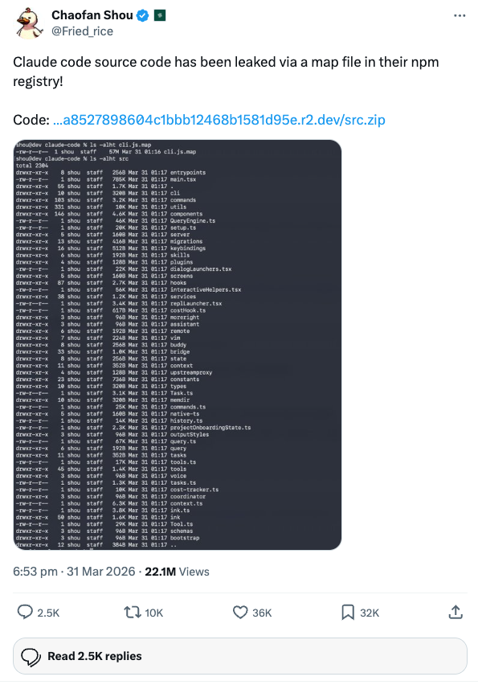

# Claude Code - Source Code (Leaked 2026-03-31)

> **Disclaimer:** This repository archives source code that was leaked from Anthropic's npm registry on 2026-03-31. All original source code is the property of Anthropic.

Source: [Twitter post by @Fried_rice](https://x.com/Fried_rice/status/2038894956459290963)



---

## How It Leaked

Chaofan Shou ([@Fried_rice](https://x.com/Fried_rice)) discovered the leak and posted it publicly:

> "Claude code source code has been leaked via a map file in their npm registry!"
>
> -- @Fried_rice, March 31, 2026

The source map file in the published npm package contained a reference to the full, unobfuscated TypeScript source, which was downloadable as a zip archive from Anthropic's R2 storage bucket.

---

## What You Can Learn From It

### Understand how Claude Code actually works under the hood
- How the system prompt is assembled (`src/constants/prompts.ts`) -- see exactly what instructions Claude gets
- How tool permissions and sandboxing work -- the security model is fully visible
- How the agent/sub-agent system spawns and manages child conversations
- How context compaction works when conversations get long
- How the memory system (MEMORY.md, memdir) reads/writes/ages memories

### Reverse-engineer undocumented behavior
- Feature flags reveal unreleased/internal features (KAIROS assistant mode, COORDINATOR_MODE, VOICE_MODE)
- The full list of 90+ slash commands, including hidden/internal ones (`/bughunter`, `/good-claude`, `/stickers`, `/thinkback`, `/teleport`)
- How permission bypass mode actually works
- What the "dream" task system does (background processing while idle)
- GrowthBook feature flag names reveal A/B tests Anthropic is running

### Study the architecture for your own projects
- The custom Ink fork is a complete React-to-terminal renderer -- useful reference for building terminal UIs
- The MCP client implementation shows how to properly integrate MCP servers
- The tool interface pattern (schema + permission + execution + UI) is a clean extensible design
- The bridge system shows how to connect a CLI to desktop/web frontends

## What You Can Actually Build

- **Custom tools/skills** -- now that you know the exact interface, you can write tools that match the internal format
- **MCP servers optimized for Claude Code** -- you can see exactly how it discovers, connects to, and calls MCP tools
- **Better CLAUDE.md files** -- reading `prompts.ts` shows exactly how CLAUDE.md content gets injected and what the model sees
- **Prompt engineering** -- the full system prompt construction reveals what instructions work and how Anthropic structures them

## What You Can't Do

- **Build and run it** -- no `package.json`, `tsconfig.json`, or build config. It uses `bun:bundle` feature flags and `MACRO.VERSION` build-time injection that require Anthropic's build pipeline.
- **Fork and redistribute** -- it's Anthropic's proprietary code.
- **Use it against their API differently** -- the API client is standard `@anthropic-ai/sdk`, nothing secret there.

## The Most Valuable Parts to Read

If you're short on time, these are the highest-signal files:

| File | Why |
|---|---|
| `src/constants/prompts.ts` | The full system prompt -- this is what makes Claude Code work the way it does |
| `src/tools/BashTool/` | The most complex tool, shows the full security/sandbox model |
| `src/tools/AgentTool/built-in/` | How built-in agents (Explore, Plan, etc.) are defined and constrained |
| `src/constants/cyberRiskInstruction.ts` | Security guardrails baked into the prompt |
| `src/utils/permissions/` | The complete permission model |
| `src/services/mcp/` | How MCP integration really works |
| `src/memdir/` | The memory system internals |
| `src/skills/bundled/` | How skills like `/commit` and `/review-pr` are defined |

The system prompt in `prompts.ts` is probably the single most valuable thing in the entire leak -- it's what defines Claude Code's behavior, and it's not something you can extract from the npm package normally.

---

## Overview

Claude Code is Anthropic's official CLI-based AI coding assistant. It provides an interactive terminal-based REPL where users can converse with Claude to perform software engineering tasks -- editing files, running commands, searching codebases, managing git workflows, and more. The application is built as a React-based terminal UI using a custom fork of Ink (a React renderer for CLI apps), powered by the Bun runtime.

The codebase contains approximately **1,900 files** (~1,884 TypeScript/TSX files) organized into a single `src/` directory with no separate packages or monorepo structure.

---

## Directory Structure

```
src/
|-- main.tsx                  # Main entry point - CLI argument parsing, session initialization
|-- Tool.ts                   # Core Tool type definitions and interfaces
|-- commands.ts               # Command registry - imports and registers all slash commands
|-- tools.ts                  # Tool registry - assembles all available tools
|-- replLauncher.ts           # Launches the interactive REPL session
|
|-- entrypoints/              # Application entry points
|   |-- cli.tsx               # Bootstrap entrypoint (--version fast path, dynamic imports)
|   |-- init.ts               # Initialization logic (telemetry, config, auth, MDM)
|   |-- mcp.ts                # MCP server entrypoint
|   |-- sdk/                  # Agent SDK entrypoint
|
|-- screens/                  # Top-level screen components
|   |-- REPL.tsx              # Main REPL screen - the primary interactive loop
|   |-- Doctor.tsx            # Diagnostic screen
|   |-- ResumeConversation.tsx
|
|-- state/                    # Application state management
|   |-- AppState.tsx          # React context-based global state (AppStateProvider)
|   |-- AppStateStore.ts      # State store definitions and defaults
|   |-- store.ts              # Store creation utilities
|   |-- selectors.ts          # State selectors
|
|-- tools/                    # Tool implementations (one directory per tool)
|   |-- BashTool/             # Shell command execution (with sandboxing, security checks)
|   |-- FileReadTool/         # File reading (text, images, PDFs, notebooks)
|   |-- FileEditTool/         # String replacement-based file editing
|   |-- FileWriteTool/        # File creation/overwriting
|   |-- GlobTool/             # File pattern matching
|   |-- GrepTool/             # Content search (ripgrep-based)
|   |-- AgentTool/            # Sub-agent spawning (with built-in agent types)
|   |-- MCPTool/              # Model Context Protocol tool execution
|   |-- WebFetchTool/         # URL fetching
|   |-- WebSearchTool/        # Web search
|   |-- NotebookEditTool/     # Jupyter notebook editing
|   |-- PowerShellTool/       # Windows PowerShell execution
|   |-- SkillTool/            # Skill/slash-command execution
|   |-- EnterPlanModeTool/    # Plan mode entry
|   |-- ExitPlanModeTool/     # Plan mode exit
|   |-- EnterWorktreeTool/    # Git worktree isolation entry
|   |-- ExitWorktreeTool/     # Git worktree isolation exit
|   |-- TaskCreateTool/       # Background task creation
|   |-- TaskGetTool/          # Task status retrieval
|   |-- TaskListTool/         # Task listing
|   |-- TaskStopTool/         # Task termination
|   |-- TaskUpdateTool/       # Task status updates
|   |-- TaskOutputTool/       # Task output retrieval
|   |-- SendMessageTool/      # Inter-agent messaging
|   |-- TeamCreateTool/       # Team/swarm agent creation
|   |-- TeamDeleteTool/       # Team agent deletion
|   |-- AskUserQuestionTool/  # User prompt/question tool
|   |-- BriefTool/            # Brief/attachment uploads
|   |-- ConfigTool/           # Settings configuration
|   |-- LSPTool/              # Language Server Protocol integration
|   |-- ScheduleCronTool/     # Cron-based scheduling
|   |-- RemoteTriggerTool/    # Remote trigger execution
|   |-- ToolSearchTool/       # Deferred tool schema fetching
|   |-- TodoWriteTool/        # Todo list management
|   |-- SleepTool/            # Sleep/delay tool
|   |-- SyntheticOutputTool/  # Synthetic output generation
|   |-- ReadMcpResourceTool/  # MCP resource reading
|   |-- ListMcpResourcesTool/ # MCP resource listing
|   |-- McpAuthTool/          # MCP authentication
|   |-- REPLTool/             # REPL primitive tools
|   |-- shared/               # Shared tool utilities
|
|-- commands/                 # Slash commands (one directory per command)
|   |-- (90+ commands including: add-dir, agents, autofix-pr, branch, bridge,
|   |    clear, color, compact, config, context, copy, cost, desktop, diff,
|   |    doctor, effort, env, exit, export, fast, feedback, files, help,
|   |    hooks, ide, init, install-github-app, install-slack-app, issue,
|   |    keybindings, login, logout, mcp, memory, mobile, model, onboarding,
|   |    output-style, permissions, plan, plugin, pr_comments, privacy-settings,
|   |    release-notes, remote-setup, rename, resume, review, rewind, sandbox-toggle,
|   |    session, share, skills, stats, status, summary, tag, tasks, teleport,
|   |    terminalSetup, theme, upgrade, usage, vim, voice, etc.)
|
|-- components/               # React UI components
|   |-- App.tsx               # Root application component
|   |-- PromptInput/          # User input prompt component
|   |-- permissions/          # Permission request dialog components
|   |-- messages/             # Message rendering components
|   |-- diff/                 # Diff display components
|   |-- StructuredDiff/       # Structured diff viewer
|   |-- agents/               # Agent management UI
|   |-- mcp/                  # MCP server UI
|   |-- memory/               # Memory system UI
|   |-- skills/               # Skills UI
|   |-- tasks/                # Task management UI
|   |-- teams/                # Team/swarm UI
|   |-- Settings/             # Settings panel
|   |-- shell/                # Shell integration components
|   |-- design-system/        # Shared design system components
|   |-- wizard/               # Wizard/step-by-step UI
|   |-- hooks/                # UI-specific hooks
|   |-- sandbox/              # Sandbox mode UI
|   |-- grove/                # Grove UI components
|
|-- ink/                      # Custom Ink fork (React terminal renderer)
|   |-- ink.tsx               # Main Ink entry
|   |-- reconciler.ts         # React reconciler for terminal
|   |-- renderer.ts           # Terminal renderer
|   |-- dom.ts                # Virtual DOM for terminal
|   |-- root.ts               # Render root
|   |-- output.ts             # Output buffer management
|   |-- render-node-to-output.ts
|   |-- render-border.ts      # Border rendering
|   |-- render-to-screen.ts   # Final screen output
|   |-- layout/               # Layout engine (Yoga-based flexbox)
|   |-- components/           # Ink base components (Box, Text, Button, ScrollBox, etc.)
|   |-- hooks/                # Ink hooks (use-input, use-stdin, use-terminal-viewport, etc.)
|   |-- events/               # Event system (click, keyboard, focus, terminal)
|   |-- termio/               # Terminal I/O parsing (ANSI, CSI, SGR, OSC, ESC)
|   |-- screen.ts             # Screen management
|   |-- terminal.ts           # Terminal capabilities
|   |-- selection.ts          # Text selection
|   |-- colorize.ts           # Color handling
|   |-- bidi.ts               # Bidirectional text support
|
|-- services/                 # Background services and integrations
|   |-- api/                  # Anthropic API client and bootstrap
|   |-- mcp/                  # MCP (Model Context Protocol) server management
|   |-- oauth/                # OAuth authentication flows
|   |-- analytics/            # Telemetry and GrowthBook feature flags
|   |-- lsp/                  # Language Server Protocol integration
|   |-- compact/              # Context compaction service
|   |-- tools/                # Tool-related services
|   |-- plugins/              # Plugin management service
|   |-- policyLimits/         # Policy and rate limit enforcement
|   |-- remoteManagedSettings/# Remote settings management
|   |-- SessionMemory/        # Session memory persistence
|   |-- extractMemories/      # Auto-memory extraction
|   |-- teamMemorySync/       # Team memory synchronization
|   |-- settingsSync/         # Settings synchronization
|   |-- AgentSummary/         # Agent summary generation
|   |-- autoDream/            # Automated background dreaming
|   |-- MagicDocs/            # Documentation fetching
|   |-- PromptSuggestion/     # Prompt suggestion service
|   |-- tips/                 # Tips and recommendations
|   |-- toolUseSummary/       # Tool usage summarization
|
|-- hooks/                    # React hooks (application-level)
|   |-- useCanUseTool.tsx     # Tool permission checking
|   |-- toolPermission/       # Tool permission handling
|   |-- useReplBridge.tsx     # REPL bridge hook
|   |-- useSettingsChange.ts  # Settings change detection
|   |-- useVimInput.ts        # Vim mode input handling
|   |-- useVoice.ts           # Voice mode hooks
|   |-- useRemoteSession.ts   # Remote session management
|   |-- (70+ more hooks)
|
|-- bridge/                   # Bridge system (Desktop/Web app <-> CLI communication)
|   |-- bridgeMain.ts         # Bridge main entry
|   |-- replBridge.ts         # REPL bridge
|   |-- bridgeApi.ts          # Bridge API
|   |-- bridgeMessaging.ts    # Message passing
|   |-- bridgeConfig.ts       # Configuration
|   |-- remoteBridgeCore.ts   # Remote bridge core
|   |-- sessionRunner.ts      # Session lifecycle
|   |-- jwtUtils.ts           # JWT authentication
|   |-- trustedDevice.ts      # Device trust
|
|-- constants/                # Application constants
|   |-- prompts.ts            # System prompt construction
|   |-- system.ts             # System constants (sysprompt prefixes)
|   |-- product.ts            # Product URLs and branding
|   |-- oauth.ts              # OAuth configuration
|   |-- tools.ts              # Tool-related constants
|   |-- betas.ts              # Beta feature flags
|   |-- apiLimits.ts          # API rate limits
|   |-- cyberRiskInstruction.ts # Security instructions
|
|-- types/                    # TypeScript type definitions
|   |-- permissions.ts        # Permission types
|   |-- hooks.ts              # Hook types
|   |-- command.ts            # Command types
|   |-- plugin.ts             # Plugin types
|   |-- generated/            # Protobuf-generated types (analytics events)
|
|-- utils/                    # Utility modules (~200+ files)
|   |-- auth.ts               # Authentication utilities
|   |-- config.ts             # Configuration management
|   |-- model/                # Model selection and providers
|   |-- permissions/          # Permission system utilities
|   |-- settings/             # Settings management (including MDM)
|   |-- git/                  # Git operations
|   |-- github/               # GitHub integration
|   |-- bash/                 # Bash command utilities
|   |-- sandbox/              # Sandbox (macOS Seatbelt) utilities
|   |-- mcp/                  # MCP utilities
|   |-- memory/               # Memory system utilities
|   |-- skills/               # Skills utilities
|   |-- plugins/              # Plugin utilities
|   |-- shell/                # Shell detection and integration
|   |-- telemetry/            # Telemetry and tracing
|   |-- swarm/                # Multi-agent swarm system
|   |-- background/           # Background task utilities
|   |-- secureStorage/        # Keychain/credential storage
|   |-- computerUse/          # Computer use utilities
|   |-- deepLink/             # Deep link handling
|   |-- dxt/                  # DXT (extension) utilities
|   |-- messages/             # Message utilities
|   |-- task/                 # Task management utilities
|   |-- todo/                 # Todo utilities
|   |-- teleport/             # Session teleport utilities
|   |-- nativeInstaller/      # Native app installer
|
|-- context/                  # React context providers
|   |-- overlayContext.tsx     # Overlay/dialog context
|   |-- mailbox.tsx           # Inter-agent mailbox
|   |-- notifications.tsx     # Notification system
|   |-- voice.tsx             # Voice mode context
|   |-- stats.tsx             # Statistics context
|   |-- fpsMetrics.tsx        # Frame rate metrics
|
|-- keybindings/              # Keybinding system
|   |-- defaultBindings.ts    # Default keyboard shortcuts
|   |-- parser.ts             # Keybinding string parser
|   |-- resolver.ts           # Keybinding resolution
|   |-- schema.ts             # Keybinding schema
|
|-- skills/                   # Skills system (slash command extensions)
|   |-- bundled/              # Bundled skill definitions
|   |-- bundledSkills.ts      # Skill registry
|   |-- loadSkillsDir.ts      # User skill directory loading
|
|-- plugins/                  # Plugin system
|   |-- bundled/              # Bundled plugins
|   |-- builtinPlugins.ts     # Built-in plugin registry
|
|-- tasks/                    # Background task types
|   |-- LocalShellTask/       # Local shell background tasks
|   |-- LocalAgentTask/       # Local agent background tasks
|   |-- RemoteAgentTask/      # Remote agent tasks
|   |-- InProcessTeammateTask/# In-process teammate (swarm) tasks
|   |-- DreamTask/            # Background "dreaming" tasks
|
|-- remote/                   # Remote session management
|   |-- RemoteSessionManager.ts
|   |-- SessionsWebSocket.ts
|   |-- remotePermissionBridge.ts
|
|-- coordinator/              # Coordinator mode (multi-agent orchestration)
|   |-- coordinatorMode.ts
|
|-- migrations/               # Config/settings migrations
|   |-- (model migration scripts, settings migrations)
|
|-- vim/                      # Vim mode implementation
|   |-- motions.ts            # Vim motions
|   |-- operators.ts          # Vim operators
|   |-- textObjects.ts        # Vim text objects
|   |-- transitions.ts        # Mode transitions
|   |-- types.ts              # Vim types
|
|-- assistant/                # Assistant mode (Kairos)
|   |-- sessionHistory.ts
|
|-- upstreamproxy/            # Upstream proxy support
|   |-- upstreamproxy.ts
|   |-- relay.ts
|
|-- voice/                    # Voice mode
|   |-- voiceModeEnabled.ts
|
|-- memdir/                   # Memory directory system
|   |-- memdir.ts             # Memory file management
|   |-- memoryScan.ts         # Memory scanning
|   |-- memoryAge.ts          # Memory aging/expiry
|   |-- paths.ts              # Memory paths
|
|-- native-ts/                # Native TypeScript implementations
|   |-- color-diff/           # Color diffing
|   |-- file-index/           # File indexing
|   |-- yoga-layout/          # Yoga layout engine bindings
|
|-- bootstrap/                # Bootstrap/startup state
|   |-- state.ts              # Global session state (counters, tokens, session ID)
|
|-- server/                   # Direct connect server
|   |-- createDirectConnectSession.ts
|   |-- directConnectManager.ts
|
|-- schemas/                  # Validation schemas
|   |-- hooks.ts              # Hook validation schemas
|
|-- outputStyles/             # Output style system
|   |-- loadOutputStylesDir.ts
|
|-- cli/                      # CLI transport layer
|   |-- handlers/             # CLI command handlers
|   |-- transports/           # I/O transports (stdio, structured, remote)
|
|-- query/                    # Query system
|   |-- config.ts             # Query configuration
|   |-- deps.ts               # Query dependencies
|   |-- tokenBudget.ts        # Token budget management
```

---

## Core Architecture

### Entry Flow

1. **`src/entrypoints/cli.tsx`** -- Bootstrap entrypoint. Handles fast paths (`--version`, `--dump-system-prompt`, `--claude-in-chrome-mcp`). For normal operation, dynamically imports `src/main.tsx`.

2. **`src/main.tsx`** -- Main entry. Uses Commander.js for CLI argument parsing. Initializes configuration, authentication, telemetry, GrowthBook feature flags, and MCP servers. Constructs the system prompt, assembles tools, and launches the REPL.

3. **`src/screens/REPL.tsx`** -- The primary interactive screen. Manages the conversation loop, message rendering, tool permission requests, input handling, session management, and background tasks.

### React Terminal UI (Custom Ink Fork)

The entire UI is built with React, rendered to the terminal via a heavily customized fork of [Ink](https://github.com/vadimdemedes/ink) located in `src/ink/`. This fork includes:

- Custom **React reconciler** (`reconciler.ts`) targeting a virtual terminal DOM (`dom.ts`)
- **Yoga-based flexbox layout** engine (`layout/`) for terminal element positioning
- Full **event system** (`events/`) with click, keyboard, focus, and terminal events
- **Terminal I/O parser** (`termio/`) handling ANSI escape sequences, CSI, SGR, OSC, DEC codes
- Components: `Box`, `Text`, `Button`, `ScrollBox`, `Link`, `AlternateScreen`, etc.
- Hooks: `use-input`, `use-stdin`, `use-terminal-viewport`, `use-selection`, etc.
- **Bidirectional text**, **hyperlink support**, **search highlighting**, **text selection**

### Tool System

Each tool lives in `src/tools/<ToolName>/` and typically contains:
- `<ToolName>.ts` or `.tsx` -- Tool implementation (extends the `Tool` interface from `src/Tool.ts`)
- `prompt.ts` -- Tool description/prompt for the system prompt
- `constants.ts` -- Tool name and config constants
- `UI.tsx` -- React component for rendering tool use/results in the terminal

Tools implement a standard interface providing: `name`, `description`, `inputSchema`, `isReadOnly()`, `needsPermissions()`, `validateInput()`, and `call()`.

### Permission System

A granular permission system controls tool execution:
- Permission modes: `default`, `plan`, `bypassPermissions`
- Per-tool permission checks with user approval dialogs
- `src/hooks/toolPermission/` handles permission logic
- `src/components/permissions/` renders approval UI for each tool type
- Bash/PowerShell tools have additional security layers: path validation, destructive command warnings, sandbox mode, read-only validation, git safety checks

### Agent/Sub-Agent System

`src/tools/AgentTool/` implements a multi-agent architecture:
- **Built-in agents** (`built-in/`): `generalPurposeAgent`, `exploreAgent`, `planAgent`, `verificationAgent`, `claudeCodeGuideAgent`, `statuslineSetup`
- Agents run as isolated sub-conversations with their own tool access
- `runAgent.ts` manages agent lifecycle
- `forkSubagent.ts` supports forking agents into git worktrees
- `agentMemory.ts` and `agentMemorySnapshot.ts` handle agent memory

### Multi-Agent Swarm System

`src/utils/swarm/` implements team-based multi-agent coordination:
- Leader/worker architecture with in-process teammate tasks
- `src/tasks/InProcessTeammateTask/` -- teammates running within the same process
- Permission synchronization across agents
- Mailbox-based inter-agent communication (`src/context/mailbox.tsx`)

### Bridge System

`src/bridge/` enables communication between the CLI and external hosts (Desktop app, Web app):
- REPL bridge for bidirectional message passing
- JWT-based authentication
- Session lifecycle management
- Remote bridge for claude.ai web sessions
- Trusted device management

### MCP (Model Context Protocol) Integration

`src/services/mcp/` provides full MCP support:
- Server connection management (stdio, SSE, HTTP, WebSocket transports)
- Tool proxying from MCP servers
- Resource reading/listing
- OAuth-based MCP authentication (`src/tools/McpAuthTool/`)
- Configuration scopes: local, user, project, dynamic, enterprise, managed

### System Prompt

`src/constants/prompts.ts` constructs the system prompt dynamically based on:
- Current model, tools, and commands available
- Permission mode and settings
- Connected MCP servers
- Active skills
- Git status and working directory context
- Output style configuration
- CLAUDE.md instructions

### State Management

- **`src/state/AppStateStore.ts`** -- Defines the global `AppState` type
- **`src/state/store.ts`** -- Creates a Zustand-like store with React context
- **`src/bootstrap/state.ts`** -- Global session state (session ID, token counters, CWD, timing)

### Command System

`src/commands/` contains 90+ slash commands, each exporting a `Command` object with:
- `name`, `description`, `isEnabled`, `isHidden`
- `userFacingName()`, `call()` -- execution logic
- Commands are registered in `src/commands.ts`

### Skills System

`src/skills/` provides an extension mechanism:
- Skills are markdown-defined prompt templates
- `bundled/` contains built-in skills (commit, review-pr, etc.)
- `loadSkillsDir.ts` loads user-defined skills from `~/.claude/skills/` and `.claude/skills/`
- Skills are invoked via `/skill-name` slash commands

### Plugin System

`src/plugins/` supports extending Claude Code:
- Plugin type definitions in `src/types/plugin.ts`
- Bundled plugins in `plugins/bundled/`
- Plugin lifecycle management in `src/services/plugins/`

### Memory System

`src/memdir/` implements persistent file-based memory:
- Memory stored as markdown files with YAML frontmatter
- Types: user, feedback, project, reference
- `MEMORY.md` index file
- Auto-memory extraction (`src/services/extractMemories/`)
- Memory aging and scanning

### Configuration

- Multi-level config: global (`~/.claude/`), project (`.claude/`), enterprise (MDM)
- `src/utils/settings/` -- Settings management with MDM (Mobile Device Management) support
- `src/utils/config.ts` -- Core config read/write
- `src/services/remoteManagedSettings/` -- Remote settings from API
- `src/services/policyLimits/` -- Policy-based limits and restrictions

### Authentication

- Anthropic API key authentication
- OAuth flow (`src/services/oauth/`)
- AWS Bedrock credentials (`src/utils/aws.ts`)
- GCP Vertex AI credentials
- Secure keychain storage (`src/utils/secureStorage/`)

### Telemetry

- OpenTelemetry-based instrumentation (`src/utils/telemetry/`)
- GrowthBook feature flags (`src/services/analytics/growthbook.js`)
- Protobuf-generated event types (`src/types/generated/`)
- Session tracing

---

## Key Files in Detail

### `src/main.tsx`
The heart of the application. Handles:
- CLI argument parsing via Commander.js (flags like `--model`, `--permission-mode`, `--system-prompt`, `--mcp-config`, etc.)
- Session restoration and conversation resumption
- Tool assembly (built-in tools + MCP tools)
- System prompt construction
- REPL initialization and React rendering via custom Ink

### `src/Tool.ts`
Defines the core `Tool` interface and related types. Key types include:
- `ToolInputJSONSchema` -- JSON Schema for tool inputs
- `Tools` -- Map of tool name to tool implementation
- `ToolUseConfirm` -- Permission confirmation callbacks
- Tool progress types (`BashProgress`, `AgentToolProgress`, `MCPProgress`, etc.)

### `src/screens/REPL.tsx`
The main interactive loop (~2000+ lines). Manages:
- Conversation message history and rendering
- API call orchestration (sending messages, handling responses)
- Tool use permission requests and approval flows
- Background task management
- Vim mode input handling
- Session backgrounding and idle detection
- Cost tracking and threshold dialogs
- REPL bridge communication

### `src/constants/prompts.ts`
System prompt assembly. Dynamically constructs the full system prompt from:
- Base system identity prefix
- Environment context (OS, shell, git status, CWD)
- Tool descriptions and usage instructions
- Permission mode instructions
- CLAUDE.md file contents
- MCP server information
- Active skill descriptions

### `src/tools/BashTool/BashTool.tsx`
The most complex tool implementation. Features:
- Command execution with timeout management
- macOS Seatbelt sandboxing (`shouldUseSandbox.ts`)
- Destructive command warnings (`destructiveCommandWarning.ts`)
- Git safety checks (`src/tools/BashTool/bashSecurity.ts`)
- Path validation and read-only mode enforcement
- Background command support
- Sed edit detection and validation

### `src/tools/AgentTool/AgentTool.tsx`
Sub-agent orchestration:
- Agent spawning with isolated tool sets and system prompts
- Built-in agent type resolution
- Agent-to-agent messaging via `SendMessageTool`
- Worktree isolation support
- Agent memory and context management

### `src/bridge/bridgeMain.ts`
Bridge system entry point for Desktop/Web app integration:
- WebSocket-based communication
- Session creation and management
- Permission delegation
- Attachment handling

---

## Tech Stack

| Component | Technology |
|---|---|
| **Runtime** | [Bun](https://bun.sh/) |
| **Language** | TypeScript (strict) |
| **UI Framework** | React 19 (with React Compiler) |
| **Terminal Renderer** | Custom Ink fork (React reconciler for terminal) |
| **Layout Engine** | Yoga (flexbox for terminal) |
| **CLI Framework** | Commander.js (`@commander-js/extra-typings`) |
| **API Client** | `@anthropic-ai/sdk` |
| **MCP** | `@modelcontextprotocol/sdk` |
| **Validation** | Zod v4 |
| **Feature Flags** | GrowthBook |
| **Telemetry** | OpenTelemetry + gRPC exporters |
| **Analytics Events** | Protobuf-generated TypeScript types |
| **Bundling** | Bun bundler (with `bun:bundle` feature flags for dead code elimination) |
| **Search** | ripgrep (via `@anthropic-ai/claude-code-rg`) |
| **Utilities** | lodash-es, chalk, figures |

### Build-Time Features

The codebase uses `bun:bundle`'s `feature()` API extensively for dead code elimination (DCE). Feature-gated modules include:
- `COORDINATOR_MODE` -- Multi-agent coordinator
- `KAIROS` -- Assistant/Kairos mode
- `KAIROS_BRIEF` -- Brief command
- `VOICE_MODE` -- Voice input mode
- `BRIDGE_MODE` -- Desktop/Web bridge
- `DAEMON` -- Remote control server
- `PROACTIVE` -- Proactive suggestions
- `ABLATION_BASELINE` -- A/B testing baseline
- `DUMP_SYSTEM_PROMPT` -- System prompt extraction (ant-only)

These feature flags allow Anthropic to build different variants (internal vs. external/public) from the same codebase.

---

## How to Run

Since this is leaked source code without the original build configuration (`package.json`, `tsconfig.json`, bundler config, etc.), **it cannot be directly built or run**. The codebase is designed to be:

1. **Bundled with Bun's bundler** -- uses `bun:bundle` imports for feature flags and dead code elimination
2. **Built with `MACRO.VERSION`** -- build-time version injection
3. **Compiled with React Compiler** -- source contains React Compiler runtime imports (`react/compiler-runtime`)
4. **Dependent on internal Anthropic infrastructure** -- API endpoints, OAuth configs, telemetry endpoints, R2 storage

To study the code, you can read it directly as TypeScript. The entry flow starts at `src/entrypoints/cli.tsx` -> `src/main.tsx` -> `src/screens/REPL.tsx`.
